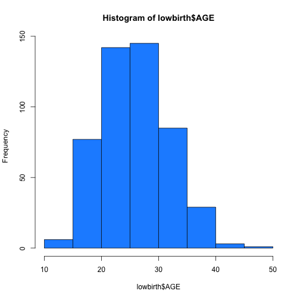

## Administration Items

1. Attendance (pass the roster around please)
2. Writing Assignment Draft (visit course website for information)
3. This Week -- Chapters 5 and 6
4. Chapter 5 -- Measuring Dispersion
5. Chapter 6 -- Constructingand Interpreting Contingency Tables
6. Homework 1 is coming up... be prepared.
7. Organize your notes and items as the semester is moving forward to limit your stress levels!

--- .class #id 

## Key Concepts One

Term                   | Pg | Brief Description
-----------------------|----|--------------------------
Dispersion             | 128| The extent of clustering or spread of the scores around the mean.
Measures of Dispersion | 128| measures of variability that addresses degree of clustering of the scores around the mean.
Range                  | 129| simplest measure of dispersion that compares the highest score and the lowest score achieved for a given set of scores.
Mean Deviation         | 130| an average distance that a score deviates from the mean.
Average Deviation      | 130| an average distance that a score deviates from the mean.
Mean Absolute Deviation| 130| an average distance that a score deviates from the mean.

--- .class #id

## Key Concepts Two

Term                   | Pg | Brief Description
-----------------------|----|--------------------------
Absolute Value         | 131| Distance or difference disregarding its sign. here the distance between each value of x and the mean, regardless of whether x is greater than the mean (a positive distance) or less than the mean (a negative distance).
Variance               | 133| An "average" or mean value of the squared deviation of the scores from the mean. 
Standard Deviation     | 133| The positive square root of the variance, which provides a measure of dispersion closer in size to the mean deviation.
Definitional Formula   | 136| A formula that not only calculates the variance, but also defines or explains the concept. In the case of variance, the formula defines it as the average (mean) amount of the squared deviations of the scores from the mean.
Computational Formula  | 137| A formula that generates a correct answer but does not seek to define what the concept, such as variance, actually is.

--- .class #id

## Prologue

Comparisons of groups by a measure of central tendency may not reveal the true story of the variables. Scores may be clustered near the mean or vastly diverse and not clustered...this is why we measure dispersion in our data that we are interested in. Two data sets can have the exact same mean butcan be entirely different. To effectively describe data, we need to know the extent of variability in the data. How far are the scores spread out? Do they cluster around the mean? This information is given by the measures of dispersion. Range, interquartile range, variance, and standard deviation are the commonly used measures of dispersion.

For this set of slides, we are looking at the low birthweight dataset (you have both the Excel and Codebook file). 

--- .class #id

## Visualizing Dispersion

* Range is the simplest measure for dispersion that compares the highest score and lowest score achieved for a given set of scores.

```r
library(gdata)
lowbirth <- read.xls ("clslowbwt.xls", sheet = 1, header = TRUE)
head(lowbirth,5)
```

```
##   ID BIRTH SMOKE RACE AGE LWT  BWT LOW
## 1  1     1     1    3  28 120 2865   0
## 2  1     2     1    3  33 141 2609   0
## 3  2     1     0    1  29 130 2613   0
## 4  2     2     0    1  34 151 3125   0
## 5  2     3     0    1  37 144 2481   1
```

### MAX AGE = 48 and MIN AGE = 14

### RANGE = 48 - 14 = 34

--- .class #id

## Histogram of Age for Mothers of Babies in the Dataset

 

--- .class #id

## The Mean Deviation

The average distance that a score deviates from the mean. In other words, we are counting the distance using absolute values. This way we don't have to worry about the signs this way :)

M.D. = $\frac{\Sigma|x-\bar{x}|}{n}$

For this exercise: let's look at page 131 and see how to work with Harriet's Group.

id | x
---|---
1  | 10
2  | 10
3  | 6
4  | 6

What is n? What is $\bar{x}$? What is the Mean Deviation?

--- .class #id

## Variance

Variance is just an average or mean value of the squared deviations of the scores from the mean.

Var = s^2 = $\frac{\Sigma(x-\bar{x})^2}{n}$

From the text book, let's look at page 133 to find the variance of Harriet's information.

The mean is 8

id | x | (x-$\bar{x}$) | (x-$\bar{x}$)^2
---|---|---------------|----------------
1  | 10| 10-8=2        | 4
2  | 10| 10-8=2        | 4
3  | 6 | 6-8=-2        | 4
4  | 6 | 6-8=-2        | 4

$\Sigma(x-\bar{x}) = 16$

To finish the equation: s^2 = $\frac{\Sigma(x-\bar{x} = 16}{n - 4} = 4.0$

--- .class #id

## Standard Deviation

The standard deviation is just the positive square root of the variance, this gives us the measure of dispersion closer in size to the mean deviation.

For Harriet's Group this would be

$\sqrt{variance} = \sqrt{s^2} = \sqrt{4} = 2$

We can do this for all items in a dataset using SPSS. 

Caveat: 

This is the most important formula in statistics

* But read on page 24 of the SPSS Guide that "for theoretical reasons" (n-1) is used in the demoninator to compute the standard devation, not n.
* Indeed, SPSS routinely uses n-1 and not n when it computes the standard deviation.
* But for now, learn this formula as the definition of the standard deviation.

--- .class #id

## Computational Formula: Variance and Standard Deviation

A computational formula that generates a correct answer but does not seek to define what the concept, such as variance, actually is.

Variance (Computational): Var = s^2 = $\frac{\Sigma(x^2-\frac{(\Sigma x^2)}{n}}{n}$

Standard Deviation: sdev = s = $\sqrt{variance}$ = $\sqrt{s^2}$ 

How does the computational equation help you in calculating the variance?

--- .class #id


## Definitional Formulas: Variance and Standard Deviation  

A definitional formula generates the correct answer and also defines or explains the concept. In the case of variance...the formula defines it as the average (mean) amount of the squared deviations of the scores from the mean. 

Variance (Definitional): Var = s^2 = $\frac{\Sigma(x-\bar{x})^2}{n}$

Standard Deviation: sdev = s = $\sqrt{variance}$ = $\sqrt{s^2}$ 

How does the definitional equation help you in calculating the variance?

--- .class #id

## Frequency Distributions: Variance and Standard Deviation Page 139

In the case of frequency distributions, we run into a slight problem if we use the formulas listed in the previous slides. To calculate we need the following equations: 

Variance (Definitional): s^2 = $\frac{\Sigma[(x-\bar{x})^2 f]}{n}$ = $\frac{\Sigma[(x-\bar{x})^2 f]}{\Sigma f}$

Variance (Computational): s^2 = $\frac{\Sigma x^2f - \frac{(\Sigma fx)^2}{n}}{n}$ = $\frac{\Sigma x^2f - \frac{(\Sigma fx)^2}{\Sigma f}}{\Sigma f}$

Standard Deviation: sdev = s = $\sqrt{variance}$ = $\sqrt{s^2}$ 

--- .class #id

## Frequency Distributions: Variance and Standard Deviation Page 139

Let's work the text book example for Group B:

id | x | f   | fx | $\bar{x}$ | $(x-\bar{x})$ | $(x-\bar{x})^2$ | $(x-\bar{x})^2 f$
---|---|-----|----|-----------|---------------|-----------------|------------------------
1  | 9 | 2   | 18 | 7.50      | 1.50          | 2.25            | 2.25 X 2 = 4.50
2  | 8 | 3   | 24 | 7.50      | 0.50          | 0.25            | 0.25 X 3 = 0.75 
3  | 7 | 3   | 21 | 7.50      | -0.50         | 0.25            | 0.25 X 3 = 0.75
4  | 6 | 2   | 12 | 7.50      | -1.5          | 2.25            | 2.25 X 2 = 4.50

n = $\Sigma f = 10$ and $\Sigma fx = 75$

$\bar{x}=\frac{\Sigma fx}{n} = \frac{\Sigma fx}{\Sigma f} = \frac{75}{10} = 7.50$

$\Sigma[(x - \bar{x})^2 f] = 10.50$

S^2 = $\frac{10.50}{10} = 1.05$ and the Standard Deviation, S = $\sqrt{Variance} = \sqrt{1.05} = 1.0246 = 1.03$

--- .class #id

## Formulas of Interest

### Individual Data

The Mean Deviation: M.D. = $\frac{\Sigma|x-\bar{x}|}{n}$

Variance (Definitional): Var = s^2 = $\frac{\Sigma(x-\bar{x})^2}{n}$

Variance (Computational): Var = s^2 = $\frac{\Sigma(x^2-\frac{(\Sigma x^2)}{n}}{n}$

Standard Deviation: sdev = s = $\sqrt{variance}$ = $\sqrt{s^2}$ 

### Frequency Distributions

Variance (Definitional): s^2 = $\frac{\Sigma[(x-\bar{x})^2 f]}{n}$ = $\frac{\Sigma[(x-\bar{x})^2 f]}{\Sigma f}$

Variance (Computational): s^2 = $\frac{\Sigma x^2f - \frac{(\Sigma fx)^2}{n}}{n}$ = $\frac{\Sigma x^2f - \frac{(\Sigma fx)^2}{\Sigma f}}{\Sigma f}$

Standard Deviation: sdev = s = $\sqrt{variance}$ = $\sqrt{s^2}$ 

--- .class #id

## Class Exercise as a Group

Read in the clslowbwt.xls file. First let's view the text files so that we can see what we are looking at. Let's look at the data and find the measures of dispersion that occurs in the dataset.

Do you think age plays a factor in determining low birth weight? How about smoking status? Can we use the Measures of Central Tendency and Measures of Dispersion to guide our analysis of the data?

--- .class #id

## Next Time

* Recap of previous weeks
* Chapter 6 -- Constructing and Interpreting Contingency Tables
* SPSS lab using chapter 5 and 6....
* More SPSS and Excel interaction
* Homework 1 is coming up
* Writing Draft (let's talk about what you want to analyze)
